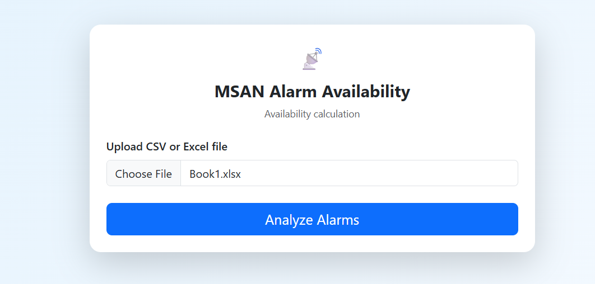
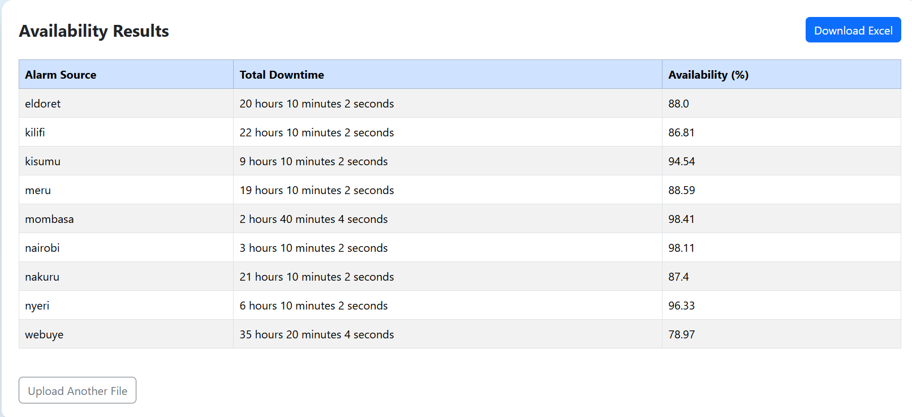

# MSAN Availability

**Simple Flask app for uploading and processing availability data** ✅

This repository contains a small Flask web application that accepts file uploads (CSV/Excel), processes them (using pandas), and displays results. It's intended as a lightweight utility to demonstrate file upload handling and basic data processing.

---

## Features

- Upload CSV or Excel files via web form
- Basic data processing with pandas
- Templates for upload and result display (`templates/`)
- Static assets in `static/` (CSS)

---

## Prerequisites

- Python 3.8+ (3.11+ recommended)
- Git (optional)

---

## Install (recommended)

Windows (PowerShell):

```powershell
# create and activate virtual environment
python -m venv .venv
.\.venv\Scripts\Activate.ps1

# install dependencies
pip install -r requirements.txt
```

macOS / Linux:

```bash
python -m venv .venv
source .venv/bin/activate
pip install -r requirements.txt
```

---

## Run the app

Simple options:

```bash
# Run directly
python app.py

# Or on Unix-like systems
sh start.sh

# Or using flask CLI (if FLASK_APP is set)
export FLASK_APP=app.py
export FLASK_ENV=development
flask run
```

On Windows (PowerShell) with flask CLI:

```powershell
$env:FLASK_APP = "app.py"
$env:FLASK_ENV = "development"
flask run
```

The app will be available at http://127.0.0.1:5000 by default.

---

## Usage

- Open the app in your browser
- Use the upload form (likely in `upload.html`) to select a CSV/Excel file
- Uploaded files are saved to `uploads/` and results are shown on `result.html` after processing

---

## Screenshots

- **Upload page** 

  

- **Results page** 

  


---

## Project structure

```
app.py
static/
  └─ styles.css
templates/
  ├─ upload.html
  └─ result.html
uploads/  # stores uploaded files
README.md
```

---

## Development & Tests

- Create a virtual environment and install dependencies (see Install section)
- Make code changes in `app.py` and templates in `templates/`
- Add unit tests (not included) and run with your preferred test runner (pytest recommended)

---

## Contributing

Pull requests are welcome. Please include a clear description and, where appropriate, tests.

---

## License

This project does not include a license file. Add a LICENSE if you plan to publish or share commercially.

---

